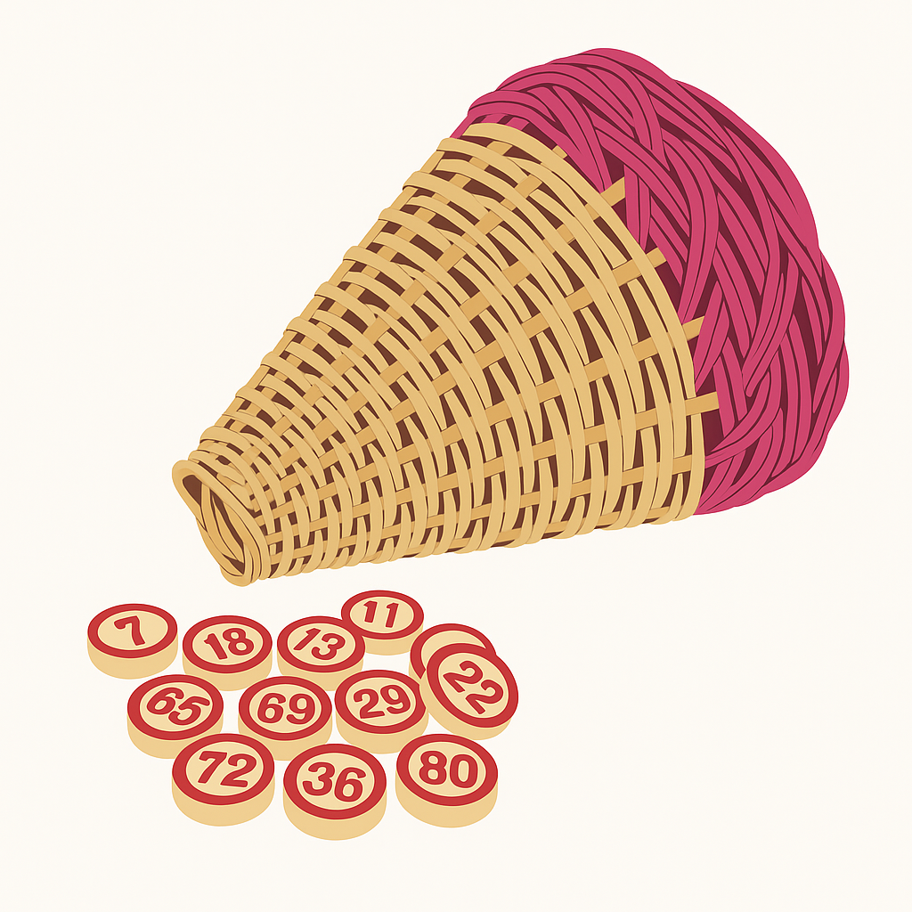

<div align="center">
  <h1 style="text-align: center; font-style: italic;">Paniere</h1>
</div>

<div align="center">
  
  <p><em>A digital version of the traditional Neapolitan Tombola game</em></p>
</div>

## 📖 Overview

Paniere is a modern digital adaptation of the traditional Neapolitan Tombola (Tombola Napoletana) game (similar to Bingo), featuring:

- **Two game modes**: Tabellone (Game Master) and Player mode
- **Authentic gameplay**: True to traditional Neapolitan Tombola rules
- **Responsive design**: Play on any device
- **Multilingual support**: Available in English and Italian
- **Accessible UI**: Keyboard navigation and screen reader support

## ✨ Features

### Tabellone Mode (Game Master)
- Draw random numbers from 1-90
- Track drawn numbers on the Tabellone board
- Automatically detect and celebrate winning patterns
- Undo last drawn number if needed
- View history of previously drawn numbers

### Player Mode
- Play with 1-10 randomly generated cartelle
- Manually mark numbers as they're called
- Authentic cartelle layout with proper number distribution
- Automatic prize detection (ambo, terno, quaterna, cinquina, tombola)
- Visual celebrations when you win

## 🛠️ Technologies

- **React 18** with **TypeScript**
- **Tailwind CSS** for styling with responsive design
- **Zustand** for lightweight state management
- **Vite** for fast development and optimized builds

## 🚀 Getting Started

### Prerequisites

- Node.js (v16+)
- npm or yarn

### Installation

```bash
# Clone the repository
git clone https://github.com/floroz/paniere.git
cd paniere

# Install dependencies
npm install
```

### Running the App

```bash
# Start development server
npm run dev
```

Visit `http://localhost:5173` in your browser to start playing.

### Building for Production

```bash
# Create optimized production build
npm run build
```

## 🎮 How to Play

### Tabellone Mode
1. Select "Tabellone Mode" on the start screen
2. Click "Draw" to randomly select numbers
3. The system automatically tracks prizes
4. Use "Undo" if needed to revert the last drawn number

### Player Mode
1. Select "Player Mode" on the start screen
2. Choose how many cartelle you want to play with (1-10)
3. As numbers are called out, mark them on your cartelle
4. The system will notify you when you win a prize

## 🏆 Prizes

- **Ambo**: Two numbers in a single row (2/5 numbers)
- **Terno**: Three numbers in a single row (3/5 numbers)
- **Quaterna**: Four numbers in a single row (4/5 numbers)
- **Cinquina**: All five numbers in a single row (5/5 numbers)
- **Tombola**: All numbers on a cartella (15/15 numbers) - the grand prize!

## 💻 Development

### Code Structure
- `src/components`: React components with folder-based organization
- `src/store`: Zustand stores for state management
- `src/utils`: Utility functions for game logic
- `src/i18n`: Internationalization files

## 📄 License

MIT
