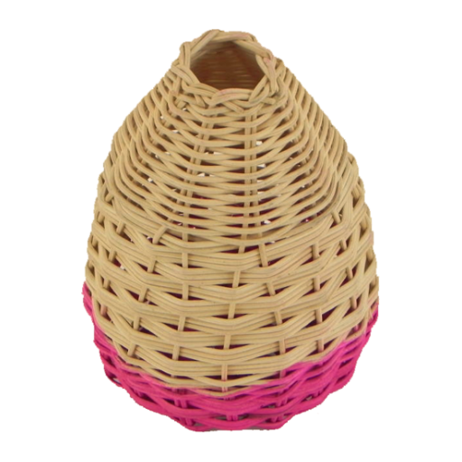

<div align="center">
  
  <h1 style="text-align: center; font-style: italic; margin-top: 0.5rem; margin-bottom: 0.5rem; font-family: serif; font-weight: bold; color: #C53030;">Paniere</h1>
  <p><em>A digital version of the traditional Neapolitan Tombola game with a retro twist!</em></p>
  <p>
    <a href="https://paniere.netlify.app" style="display: inline-block; padding: 12px 24px; background-image: linear-gradient(to bottom right, #F56565, #DD6B20); color: white; font-weight: bold; text-decoration: none; border-radius: 8px; box-shadow: 0 5px 10px rgba(0, 0, 0, 0.15); transition: all 0.2s ease-in-out;" onmouseover="this.style.transform='translateY(-2px)'; this.style.boxShadow='0 8px 15px rgba(0, 0, 0, 0.2)';" onmouseout="this.style.transform='translateY(0)'; this.style.boxShadow='0 5px 10px rgba(0, 0, 0, 0.15)';">Play Now!</a>
  </p>
</div>

## 📖 Overview

Paniere brings the classic Neapolitan Tombola (similar to Bingo) to your browser with a fun, retro-inspired interface. Experience the excitement of drawing numbers and marking your cards, whether you're the game master or a player.

**Key Features:**

-   🎲 **Two Game Modes**: Play as the **Game Master** (Tabellone) drawing numbers, or as a **Player** marking your cards (Cartelle).
-   🇮🇹 **Authentic Gameplay**: Follows traditional Neapolitan Tombola rules and number distribution.
-   🎨 **Retro Theme**: Enjoy a visually distinct interface with warm colors and classic typography.
-   📱 **Responsive Design**: Play smoothly on desktop, tablet, or mobile.
-   🌐 **Multilingual**: Available in English and Italian.
-   ⌨️ **Accessible UI**: Designed with keyboard navigation and screen reader support in mind.
-   📊 **Analytics**: Uses Google Analytics (GA4) for usage insights.

## ✨ Features Breakdown

### Game Master Mode (Tabellone)

-   Draw random numbers (1-90) one by one.
-   Visualize drawn numbers on the interactive Tabellone board.
-   Undo the last drawn number if a mistake is made.
-   View the history of the last few drawn numbers.
-   Reset the board to start a new game.

### Player Mode (Cartelle)

-   Play with 1 to 10 randomly generated, authentic cartelle.
-   Mark numbers on your cartelle as they are called out:
    -   **Click/Tap**: Simply click or tap the number on your card.
    -   **Manual Input**: Type the number into the dedicated input field in the footer for quick marking.
-   Automatic prize detection: The game highlights winning rows for Ambo, Terno, Quaterna, and Cinquina.
-   Tombola Celebration: A visual confetti celebration when you hit Tombola!
-   Undo your last mark if you make a mistake.

## 🛠️ Technologies

-   **Framework**: React 19 with TypeScript
-   **Styling**: Tailwind CSS (Utility-first CSS framework)
-   **State Management**: Zustand (Simple, fast state management)
-   **Analytics**: React GA4 (Google Analytics integration)
-   **Build Tool**: Vite (Next-generation frontend tooling)

## 🚀 Getting Started

### Prerequisites

-   Node.js (Check `.nvmrc` for the recommended version, typically v18+)
-   npm or yarn

### Installation

```bash
# 1. Clone the repository
git clone https://github.com/floroz/paniere.git
cd paniere

# 2. Install dependencies
npm install
```

### Running Locally

```bash
# Start the development server
npm run dev
```

Open your browser and navigate to `http://localhost:5173` (or the port specified in the console).

### Building for Production

```bash
# Create an optimized production build in the 'dist' folder
npm run build
# or
yarn build
```

## 🎮 How to Play

1.  **Visit the App**: Go to [paniere.netlify.app](https://paniere.netlify.app) or run it locally.
2.  **Select Language**: Choose English or Italian using the flag buttons.
3.  **Choose Mode**:
    *   **Game Master**: Select this to run the Tabellone and draw numbers. Click "Draw" to get started.
    *   **Player**: Select this, choose the number of cartelle (1-10), and click "Start Game".
4.  **Play!**:
    *   **Game Master**: Keep clicking "Draw". Use "Undo" or "Reset" as needed.
    *   **Player**: As numbers are announced (by a real-life game master or the app in Game Master mode), mark them on your cards by clicking/tapping or using the manual input field in the footer. Watch for automatic prize highlights!

## 🏆 Prizes (Premi)

The game automatically detects these winning combinations on your cartelle:

-   **Ambo**: Two numbers in a single row.
-   **Terno**: Three numbers in a single row.
-   **Quaterna**: Four numbers in a single row.
-   **Cinquina**: All five numbers in a single row.
-   **Tombola**: All 15 numbers on a single cartella – the grand prize!

## 📄 License

This project is licensed under the MIT License. See the [LICENSE](./LICENSE) file for details.
